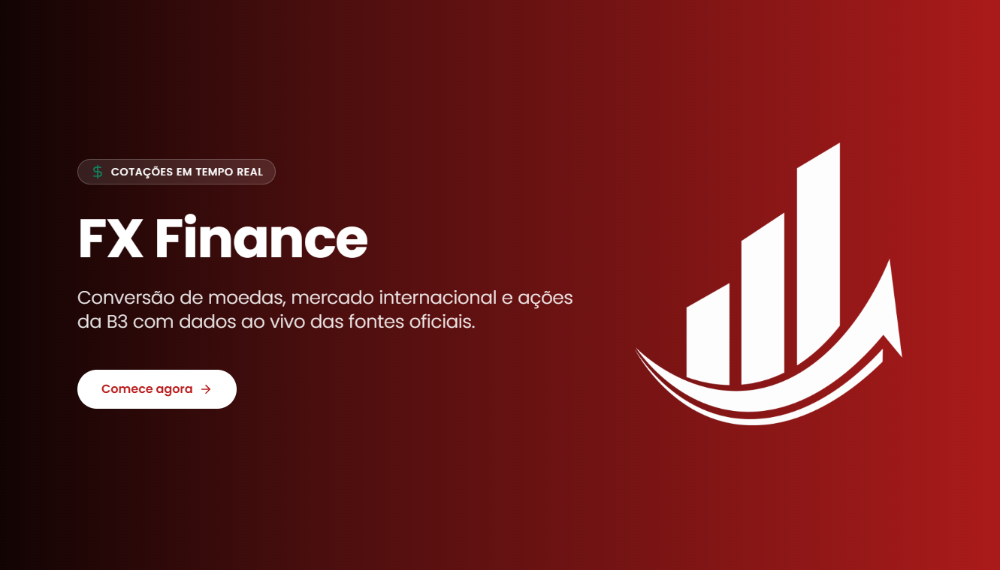

<div align="center">

# 🪙💲 FX Finance 💲🪙

### Dashboard fintech com cotações de moedas, ações e criptomoedas em tempo real

[](https://currency-stocks-dashboard.vercel.app/)
[](https://github.com/Doug1980/currency-stocks-dashboard)




</div>

---

## 📋 Sobre o Projeto

**FX Finance** é uma plataforma fintech que entrega dados financeiros em tempo real, integrando **3 APIs externas distintas** para oferecer cotações de moedas globais, ações americanas, criptomoedas e ações brasileiras da B3 — tudo em uma interface única, responsiva e premium.

O projeto demonstra integração avançada de APIs externas, padrões de arquitetura modernos (BFF), estratégia de cache em camadas, e pipeline completo de CI/CD com deploy automático.

🌐 **Demo ao vivo:** [fxfinance.vercel.app](https://fxfinance.vercel.app/)

---

## ✨ Features Implementadas

### 💱 Conversor de Moedas (`/converter`)
- 20 moedas globais com bandeiras PNG via `flagcdn.com`
- Conversão em tempo real via API Frankfurter
- Histórico persistente em `localStorage` (últimas 5 conversões)
- Botão **swap** com animação spring (Framer Motion)
- Aplicação automática de conversão histórica ao clicar

### 📈 Mercado Internacional (`/stocks`)
- 60 ativos americanos: 12 criptomoedas + 48 ações em 4 setores
- Cotações live via API Finnhub (com auto-refresh a cada 90s)
- **6 carrosséis horizontais**: Cripto, Tecnologia, Financeiro, Consumo, Saúde + **Top Movers** dinâmico
- **Logos oficiais das empresas** via endpoint `/stock/profile2`
- **Logos de cripto** servidas via CDN da CoinGecko
- Badge "🔥 Em alta" para variações superiores a 3%
- Ranking 1-12 nos Top Movers do dia

### 🇧🇷 Mercado Nacional (`/stocks-br`)
- 60 ações da B3 em 5 setores: Energia, Bancos, Varejo, Telecom/Tech, Consumo
- Cotações em **Reais (BRL)** via API brapi.dev
- **Logos SVG oficiais** das empresas brasileiras
- Mesmos componentes reutilizados do mercado internacional (DRY)

### 🎨 Identidade Visual Premium
- Paleta **rubi com tons quentes** inspirada em apps fintech profissionais
- Tipografia Poppins com pesos variados
- Backgrounds com **gradient orbs** (CSS puro, sem JS) por página
- Botão "Atualizar" com animação spring de sucesso (verde + check)
- Transições suaves entre páginas (`template.tsx`)
- 100% responsivo (testado em desktop e mobile)

---

## 🛠️ Stack Técnica

### Frontend
- **Next.js 16** com App Router e Turbopack
- **React 19** com hooks customizados
- **TypeScript** estrito
- **Tailwind CSS v4** com `@theme` e CSS variables
- **Framer Motion** para animações
- **Lucide React** para ícones

### Backend (BFF)
- **Route Handlers** do Next.js (`/api/*`)
- Cache HTTP com `Cache-Control` e `stale-while-revalidate`
- `fetch` nativo do Next com `revalidate` server-side

### Infraestrutura
- **Vercel** para hosting e CI/CD
- **GitHub** com auto-deploy via push
- Edge functions para BFF
- Variáveis de ambiente seguras

---

## 🏗️ Arquitetura

O projeto adota o padrão **Backend for Frontend (BFF)**: o cliente nunca conversa diretamente com APIs externas. Em vez disso, faz requisições para nossos próprios endpoints (`/api/exchange`, `/api/stocks`, `/api/stocks-br`) que:

- ✅ Escondem chaves de API privadas (FINNHUB_API_KEY, BRAPI_API_TOKEN)
- ✅ Adicionam cache em múltiplas camadas
- ✅ Normalizam respostas heterogêneas em formato único
- ✅ Aplicam **fail-soft**: se um ativo falhar, os outros continuam carregando

### Estratégia de Cache em Camadas

| Camada | Localização | Duração | Aplicação |
|---|---|---|---|
| Browser | localStorage | Persistente | Histórico de conversões |
| HTTP | `Cache-Control` | 60-120s | Quotes (cotações ao vivo) |
| Server | `next: { revalidate }` | 24h | Logos das empresas (Finnhub) |
| CDN | Vercel Edge | Auto | Assets estáticos |

### Estratégia de Logos em Camadas

| Mercado | Estratégia | Latência |
|---|---|---|
| 🇧🇷 Ações BR | Campo `logourl` no JSON da brapi | ⚡ Zero |
| 🇺🇸 Ações US | Endpoint `/stock/profile2` da Finnhub (cache 24h) | ⚡ Zero (após primeira carga) |
| 🪙 Cripto | URLs hardcoded apontando para CoinGecko CDN | ⚡ Zero |
| 🏳️ Bandeiras | PNGs de `flagcdn.com` | ⚡ Zero |

---

## 🔌 APIs Integradas

| API | Uso | Tier | Endpoint |
|---|---|---|---|
| **Frankfurter** | Cotações de moedas | Grátis (sem auth) | `api.frankfurter.app` |
| **Finnhub** | Ações US + cripto + logos | Free (60 req/min) | `finnhub.io/api/v1` |
| **brapi.dev** | Ações brasileiras (B3) | Free (token) | `brapi.dev/api` |
| **CoinGecko CDN** | Logos de criptomoedas | Grátis (sem auth) | `assets.coingecko.com` |
| **flagcdn** | Bandeiras dos países | Grátis (sem auth) | `flagcdn.com` |

---

## ⚙️ Como Rodar Localmente

### Pré-requisitos
- Node.js 20+
- Conta gratuita na [Finnhub](https://finnhub.io/register) (para FINNHUB_API_KEY)
- Conta gratuita na [brapi.dev](https://brapi.dev/dashboard) (para BRAPI_API_TOKEN)

### Setup

1. **Clone o repositório**
```bash
   git clone https://github.com/Doug1980/currency-stocks-dashboard.git
   cd currency-stocks-dashboard
```

2. **Instale as dependências**
```bash
   npm install
```

3. **Configure as variáveis de ambiente**
   Copie `.env.example` para `.env.local`:
```bash
   cp .env.example .env.local
```
   Edite `.env.local` e preencha com suas chaves reais:
```env
   FINNHUB_API_KEY=sua_chave_finnhub_aqui
   BRAPI_API_TOKEN=seu_token_brapi_aqui
   NEXT_PUBLIC_APP_NAME=FX Finance
```

4. **Rode em desenvolvimento**
```bash
   npm run dev
```
   Acesse `http://localhost:3000`

### Scripts disponíveis

```bash
npm run dev      # Inicia servidor de desenvolvimento (Turbopack)
npm run build    # Build de produção
npm run start    # Inicia servidor de produção
npm run lint     # Executa ESLint
```

---

## 📁 Estrutura do Projeto

```
currency-stocks-dashboard/
├── docs/
│   └── screenshot.png        # Print da home
├── public/
│   └── finace_logo.svg       # Logo SVG do app
├── src/
│   ├── app/
│   │   ├── api/              # Route Handlers (BFF)
│   │   │   ├── exchange/     # Conversão de moedas
│   │   │   ├── stocks/       # Ações US + cripto
│   │   │   └── stocks-br/    # Ações brasileiras
│   │   ├── converter/        # Página do conversor
│   │   ├── stocks/           # Painel internacional
│   │   ├── stocks-br/        # Painel nacional
│   │   ├── globals.css       # Tailwind + CSS variables + orbs
│   │   ├── layout.tsx        # Root layout (metadata)
│   │   ├── page.tsx          # Home (hero rubi)
│   │   └── template.tsx      # Transição entre páginas
│   ├── components/
│   │   ├── converter/        # Conversor + Histórico + Selector
│   │   ├── currency/         # CurrencyFlag (PNG via flagcdn)
│   │   ├── layout/           # Navbar
│   │   ├── stocks/           # StockCard + CategoryCarousel
│   │   └── ui/               # AnimatedNumber
│   ├── hooks/
│   │   ├── useExchangeRate.ts        # Taxa de câmbio
│   │   ├── useStockQuote.ts          # Ações US polling 90s
│   │   ├── useBrazilianStocks.ts     # Ações BR polling 90s
│   │   ├── useConversionHistory.ts   # Histórico SSR-safe
│   │   └── useRefreshStatus.ts       # Animação botão refresh
│   ├── lib/
│   │   ├── api/              # Clientes Frankfurter, Finnhub, brapi
│   │   ├── currencies.ts     # 20 moedas + countryCode
│   │   ├── stocks.ts         # 60 ativos US (com logos cripto)
│   │   ├── stocks-br.ts      # 60 ativos BR
│   │   └── utils.ts          # Helpers
│   └── types/
│       └── index.ts          # Tipos compartilhados
├── .env.example              # Template de variáveis
├── next.config.ts            # Config (remotePatterns para imagens)
└── tsconfig.json             # TypeScript estrito
```

---

## 🎨 Decisões Técnicas Importantes

### 1. **TypeScript estrito desde o início**
Todos os retornos de API tipados. Compilação falha em qualquer `any` implícito. Garante refatoração segura.

### 2. **Hooks customizados para encapsular polling**
Cada fonte de dados (`useStockQuote`, `useBrazilianStocks`, `useExchangeRate`) gerencia seu próprio ciclo: fetch inicial, polling, error handling, refresh manual.

### 3. **`Promise.all` aninhado para paralelização**
No BFF de stocks, cada ativo dispara quote + logo simultaneamente. Os 60 ativos são processados em paralelo. Tempo total = mais lento, não soma.

### 4. **Fail-soft em múltiplas camadas**
- Cliente brapi: se um batch de 20 falhar, tenta individual
- BFF: se um ativo falhar, retorna placeholder para os outros
- StockCard: se logo não carregar, mostra apenas símbolo
- Hooks: filtram quotes inválidos antes de renderizar

### 5. **CSS variables via Tailwind v4 `@theme`**
Paleta inteira em `globals.css`, acessível como `var(--color-brand)`. Mudança de cor = 1 linha.

### 6. **Backgrounds com gradient orbs em CSS puro**
3 variantes (rubi, stocks, br) usando pseudo-elementos `::before` e `::after` com `radial-gradient` + `blur`. Zero JavaScript = performance perfeita.

### 7. **Caching agressivo de logos (24h)**
Logos não mudam — não faz sentido buscar em todo polling. `next: { revalidate: 86400 }` no fetch da Finnhub reduz drasticamente uso de quota.

---

## 📞 Contato

**Douglas Salazar**
Full Stack Developer • Brasil 🇧🇷

[](mailto:douglassalazar1980@gmail.com)
[](https://www.linkedin.com/in/douglas-salazar80/)

---

<div align="center">

**Feito com 💎 e muito ☕ em São Paulo**

⭐ Se gostou do projeto, deixe uma estrela no repositório!

</div>
